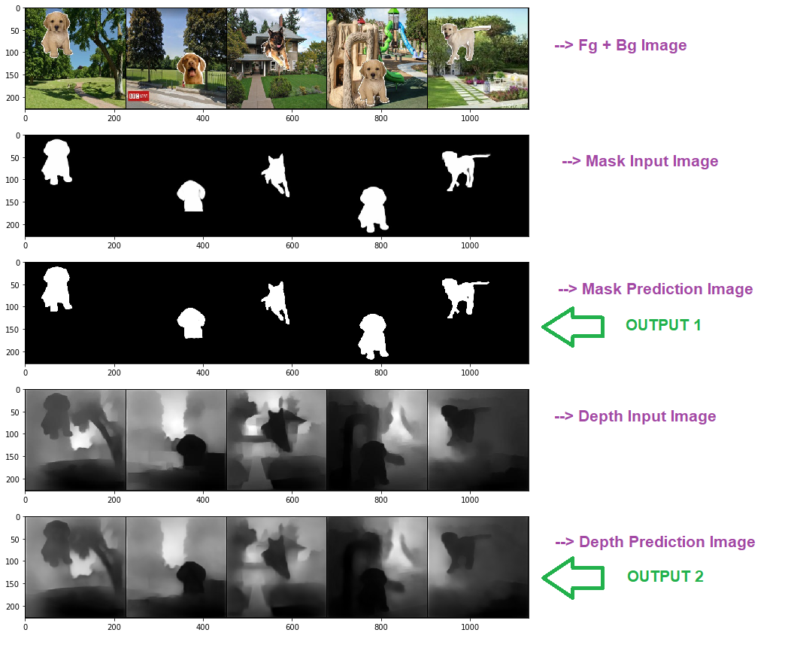
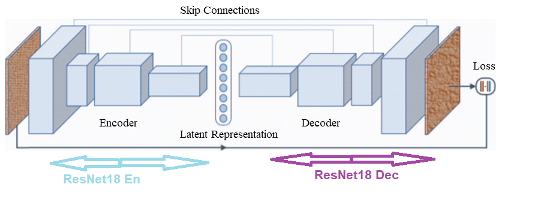

# Mask & Depth Prediction Model

## 1. Result 

**Metric**: Can be used IOU or Dice score. I used Dice score here. [Dice Coeff source](https://github.com/milesial/Pytorch-UNet/blob/master/dice_loss.py)

- Dice Score for Mask : **0.946**  
- Dice Score for Depth : **0.522**

Sample Output: 



## 2. Dataset
Input: Foreground placed on background Image (fgbg), Background Image [224x224**x3**]<br/>
Target: Mask, Depth [224x224**x1**] <br/>
Image size: **224x224** <br/>
Total Images:- 400k per category <br/>

Custom dataset & dataloder written on notebook only [Depth_Mask_Prediction.ipynb](Depth_Mask_Prediction.ipynb)

### 2.1 Dataset Creation for Depth & Mask Prediction [400K Image]

1. **Download 100 park(Background) & 100 transparent dog (Foreground) images using  [Image Downloader](https://chrome.google.com/webstore/detail/image-downloader/cnpniohnfphhjihaiiggeabnkjhpaldj?hl=en-US)**

2. **Generate 400k fgbg images (Background+Foreground) + Mask Images**
    - 400k = 100 * 100 * 2 * 20 
    - 100 = No. of Foreground Image
    - 100 = No. of Background Image
    - 2   = Flip Foreground Image
    - 20 = Randomly place each Foreground image 20 times on single Background image
    - Image Shape = **224x224**


3. **Depth for 400K fgbg images**
    - Used [DenseDepth](https://github.com/ialhashim/DenseDepth) for generating depth image (https://github.com/ialhashim/DenseDepth)

## 3. Model
Used modified resnet18 based basic autoencoder with skip connection. Skip connection improve model performance exponetially. <br/>
Model code: [Custom_VAE.py](Custom_VAE.py)

 


## 4. Loss Function
```
BCEWithLogitsLoss: Mask Prediction 
SSIM : Depth Prediction
```

L1Loss, SmoothL1Loss, MSELoss & BCEWithLogitsLoss were tried for Mask Prediction. BCEWithLogitsLoss is giving best performance for Mask prediction

SSIM used from [kornia repo](https://github.com/kornia/kornia.git)
```python
git clone https://github.com/kornia/kornia.git 
from kornia.losses import SSIM  
```
